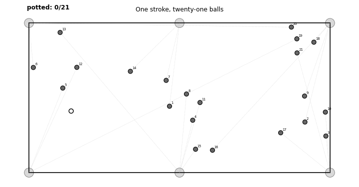

# One Shot, Twenty-One Balls

**Existence and rarity of a total clearance in a single stroke of snooker.**

Snooker folklore holds that no single stroke can pocket all twenty-one
object balls. This repository accompanies a short mathematics paper that
takes the claim seriously inside a fully specified model of billiard
dynamics, and finds that the folklore is *right in practice and wrong in
principle*. The gap between those two is exactly the distance between
**measure zero** and **unobservably small** — which is what the paper is
about.

<p align="center">
  
</p>

The animation above is not a mock-up. A single cue stroke pockets **all
21** object balls in one continuous run of the model's own physics
engine. You can reproduce and re-verify it from this repo in a few
seconds (`python3 witness_verify.py`), and regenerate the animation with
`python3 make_gif.py`.

## The three claims

The folklore actually bundles three different statements:

1. **No legal stroke can *possibly* pot all twenty-one balls.**
   *False.* We exhibit an explicit witness — a configuration and a
   stroke that clears all 21 — and prove the set of successful strokes
   has **positive Lebesgue measure** (it is an open set, not a lone
   coincidence). So a total clearance is possible, and possible in a
   mathematically robust way.

2. **From the regulation opening break, no stroke pots all twenty-one.**
   *Conjectured false, and open.* We explain why this sits in a
   computational blind spot: it is decidable *in principle* by a single
   certified simulation, yet hopeless to settle by brute-force sampling.

3. **You will never see it happen.**
   *True, overwhelmingly.* Monte Carlo experiments estimate the
   probability `P(k)` that a uniformly random stroke pots exactly `k`
   balls. The decay is cleanly exponential; extrapolated to `k = 21` it
   lands around `10⁻¹²`, far beyond anything observable.

The twist in claim 1: the success set for our 21-ball witness, while
genuinely open (hence positive measure), is *extraordinarily thin* — a
change of order `10⁻⁶ m/s` in cue speed already spoils the clearance.
Positive measure and observable robustness part company, and that parting
is the paper's theme. (Shorter chains built by the same method have
visibly fat success sets — a 3-ball clearance survives a `~0.1 m/s`
window, five orders of magnitude wider.)

## The model in one paragraph

A rectangular table (`L × W`), 22 unit-radius balls, constant
deceleration `a` opposing motion (rolling friction), ball–ball collisions
with normal restitution `e`, cushion rebounds with restitution `e_c`, six
pocket capture-disks of radius `ρ`, and no spin. A "shot" is a pair
`(V₀, φ)`: launch speed and direction of the cue. Everything is
event-driven and exact between events, so a trajectory is a finite
composition of explicit algebraic maps. Full constants are in
`model_sim.py` and in the paper's Appendix A.

## How the witness was built

Earlier attempts predicted the whole collision chain analytically and
then checked it — but once cushion rebounds accumulate, an analytic path
drifts from what the engine actually does, and nothing reproduces. The
working method (`witness_bv.py`) is **build-and-verify**: it grows the
chain one collision at a time *inside* the engine, reading the cue's
actual post-collision state, placing each new ball so the struck ball
departs straight at a pocket, and re-verifying the whole prefix (every
placed ball must actually pocket) before committing. The engine is the
single source of truth, so there is no drift by construction.

The physical trick that makes 21 reachable: the cue is the sole carrier
and must survive 21 collisions, so it uses **thick, near-grazing cuts**
that keep ~90%+ of its speed while still sending each struck ball off
with enough to reach a pocket, plus cushion rebounds to reach balls all
over the table.

## Repository layout

```
.
├── model_sim.py        # the event-driven physics engine (the model)
├── model_sim_v0.py     # independent reference engine (cross-check)
├── witness_bv.py       # build-and-verify witness constructor
├── witness_verify.py   # standalone verifier for a witness JSON
├── mc_break.py         # Monte Carlo P(k) + parameter sensitivity grid
├── make_figures.py     # regenerates both figures
├── make_gif.py         # renders the animated clearance (witness_clearance.gif)
│
├── witness_21.json     # the verified 21-ball clearance (cue shot + coords)
├── mc_results.json     # 30,000-stroke P(k) distribution
├── mc_sensitivity.json # 9-cell friction × restitution grid
├── bv_robust.json      # a robustness-optimized short chain (fat success set)
│
├── witness_layout.pdf/png   # the witness figure (static)
├── witness_clearance.gif    # the witness, animated
├── pk_decay.pdf/png         # the P(k) decay figure
│
├── paper/              # the LaTeX manuscript and generated tables
│   ├── main.tex        # the paper
│   ├── main.pdf        # compiled
│   ├── appendix_witness.tex, results_table.tex, sensitivity_table.tex
│
└── archive/            # the earlier open-loop constructors (see note below)
```

**About `archive/`.** These are the abandoned open-loop constructors
(`witness_tree.py`, `trunk_cushion.py`, etc.) and their status notes. They
do **not** produce a verified witness — they are kept only to document the
approach that failed and why the build-and-verify rewrite was necessary.
Nothing in the top-level pipeline depends on them.

## Requirements

* Python 3.8+
* Standard library only for the engine, constructor, verifier, and Monte
  Carlo (`math`, `random`, `json`, ...).
* `matplotlib` only for `make_figures.py`.

No other dependencies.

```bash
pip install matplotlib   # only needed for the figures
```

## Reproduce everything

```bash
# 1. Verify the 21-ball clearance independently (a few seconds)
python3 witness_verify.py
#    -> replays the shot in the engine and confirms 21/21 potted,
#       cue not potted, configuration admissible, with margins.

# 2. Rebuild a witness from scratch (randomized; finds a 21-chain in seconds)
python3 -c "import witness_bv, json; \
w=None; \
[ (w := witness_bv.build_greedy(seed=s, n_target=21)) for s in range(40) \
  if w is None or w['n'] < 21 ]; \
print('reached', w['n'] if w else 0)"

# 3. Monte Carlo P(k) over N strokes (resumable; writes mc_results.json,
#    the LaTeX table, and the fit summary)
python3 mc_break.py 30000
#    sensitivity grid:
python3 mc_break.py 2500 sens

# 4. Regenerate both figures
python3 make_figures.py

# 5. Build the paper
cd paper && pdflatex main.tex && pdflatex main.tex
```

The Monte Carlo is seeded and resumable: re-running `python3 mc_break.py
100000` continues from the existing `mc_results.json` and refreshes the
table, fit, and figure automatically.

## The witness, concretely

`witness_21.json` records the cue position, `V₀ = 11.9 m/s`, `φ`, and the
21 object-ball coordinates with their target pockets. Verified end to
end: 21/21 object balls pocketed, cue not pocketed, all six pockets used,
minimum pairwise ball separation 15.4 cm, pocket-entry speeds 0.14–4.27
m/s. The full coordinate table is Appendix A of the paper.

## Status of the proof

The existence theorem is **computer-assisted**: the witness trajectory is
a finite composition of explicit algebraic maps, verified in double
precision with margins many orders of magnitude above the rounding scale.
A rigorous interval-arithmetic certificate would be a routine finite
upgrade; the paper flags this explicitly.

## Citation

If you use this work, please cite the paper:

```bibtex
@misc{kantor2026oneshot,
  author       = {Avner Kantor},
  title        = {One Shot, Twenty-One Balls: Existence and Rarity of a
                  Total Clearance in a Single Stroke of Snooker},
  year         = {2026},
  howpublished = {Manuscript and code},
  note         = {Israel Central Bureau of Statistics},
  url          = {https://github.com/avnerkantor/one-shot-twenty-one-balls}
}
```

Add a DOI (e.g. via Zenodo) or an arXiv identifier here when available. A
plain-text citation and machine-readable metadata are in
[`CITATION.cff`](CITATION.cff).

## Author

**Avner Kantor** — Israel Central Bureau of Statistics.

## License

Released under the MIT License — see [`LICENSE`](LICENSE).
